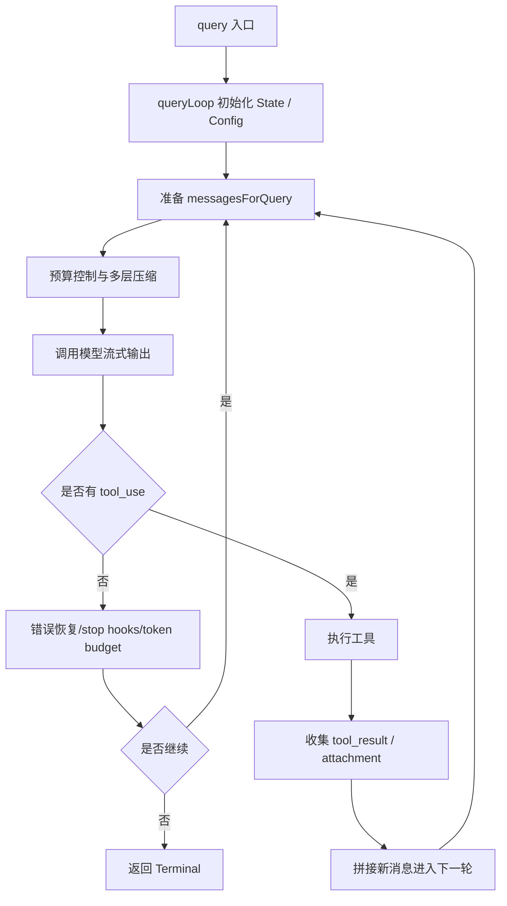

## 一、方法定位

在 `query.ts` 中，`query` 是整个会话执行链路的**顶层异步生成器入口**：

```ts
export async function* query(
  params: QueryParams,
): AsyncGenerator<
  | StreamEvent
  | RequestStartEvent
  | Message
  | TombstoneMessage
  | ToolUseSummaryMessage,
  Terminal
>
```

它不是一个“单次请求函数”，而是一个**可流式产出事件、支持多轮递归推进的会话驱动器**。

简单说，`query` 做的是：

- 接收一轮用户上下文与运行参数
- 驱动模型发起推理
- 流式输出模型消息
- 识别并执行工具调用
- 把工具结果再送回模型继续推理
- 在必要时做上下文压缩、错误恢复、终止控制
- 最终返回本轮对话为何结束的 `Terminal`

---

## 二、`query` 本身做了什么

`query` 本体其实很薄，核心逻辑都在内部的 `queryLoop`：

```ts
export async function* query(...) {
  const consumedCommandUuids: string[] = []
  const terminal = yield* queryLoop(params, consumedCommandUuids)
  for (const uuid of consumedCommandUuids) {
    notifyCommandLifecycle(uuid, 'completed')
  }
  return terminal
}
```

所以 `query` 的职责主要有两个：

- **委托执行**
  - 用 `yield* queryLoop(...)` 把整个查询主循环代理出去
- **收尾通知**
  - 对在这轮执行中真正被消费过的命令，补发 `completed` 生命周期通知

因此可以把 `query` 理解为：

- **公开入口**
- **生命周期包装器**
- **最终收口点**

而真正的“智能体式执行循环”在 `queryLoop` 中完成。

---

## 三、核心原理

`query` / `queryLoop` 的核心原理可以概括成一句话：

> **它把“模型生成 → 工具执行 → 结果反馈 → 再生成”组织成一个可恢复、可流式、可中断、可压缩的状态机循环。**

这个状态机不是通过显式 `switch(state)` 写出来的，而是通过：

- 一个可变的 `State`
- 一系列 `continue`
- 若干终止 `return { reason: ... }`

来驱动。

---

## 四、整体架构抽象

可以把它抽象为 5 层：

### 1. 输入层
包括：

- `messages`
- `systemPrompt`
- `userContext`
- `systemContext`
- `toolUseContext`
- `canUseTool`
- `querySource`
- `fallbackModel`
- `taskBudget`
- `deps`

其中 `deps` 在 `deps.ts` 中定义，是一种**依赖注入设计**：

- `callModel`
- `microcompact`
- `autocompact`
- `uuid`

这使 `query` 更容易测试和替换底层实现。

---

### 2. 状态层

`queryLoop` 维护一个循环状态 `State`，关键字段有：

- `messages`
- `toolUseContext`
- `autoCompactTracking`
- `maxOutputTokensRecoveryCount`
- `hasAttemptedReactiveCompact`
- `maxOutputTokensOverride`
- `pendingToolUseSummary`
- `stopHookActive`
- `turnCount`
- `transition`

这意味着 `query` 不是“函数式单步执行”，而是**跨迭代保存运行状态**。

---

### 3. 模型层

每轮循环会：

- 组装上下文
- 补充系统上下文 / 用户上下文
- 进行 token 限制检查
- 调用模型流式输出
- 流式消费 `assistant` 消息

模型输出不只是文本，还可能包括：

- `tool_use`
- 错误消息
- 思考块
- 中间流式事件

---

### 4. 工具层

如果模型输出了 `tool_use`，则进入工具执行阶段：

- 普通工具编排：`runTools`
  - 文件：`toolOrchestration.ts`
- 流式工具执行器：`StreamingToolExecutor`
  - 文件：`StreamingToolExecutor.ts`

执行后的 `tool_result` 会重新拼入消息列表，进入下一轮模型调用。

---

### 5. 控制层

贯穿整个过程的控制能力包括：

- 上下文压缩
- Prompt Too Long 恢复
- `max_output_tokens` 恢复
- fallback model 切换
- stop hooks
- token budget 续跑控制
- 最大轮数控制
- 中断处理
- 队列命令注入
- memory / skill prefetch 注入

---

## 五、完整流程

下面按执行顺序介绍主流程。

---

## 六、主流程分解

### 1. 入口包装

`query` 创建 `consumedCommandUuids`，调用 `queryLoop`。

目的：

- 主循环专注于执行
- 外层专注于生命周期通知和收尾

这是一个很干净的分层。

---

### 2. 初始化状态与配置快照

`queryLoop` 开始时会做两类初始化。

#### 2.1 初始化 `State`

把参数转成内部可变状态：

- 当前消息列表
- 当前工具上下文
- 当前轮数
- 错误恢复计数
- 是否已做过 reactive compact
- 上一轮为何继续等

#### 2.2 构建不可变配置快照

通过 `config.ts` 的 `buildQueryConfig()` 构造：

- `sessionId`
- `streamingToolExecution`
- `emitToolUseSummaries`
- `isAnt`
- `fastModeEnabled`

这一步很重要：

- **运行期可变 gate 在入口快照化**
- **feature() 类 tree-shaking gate 保持内联**

这是为了兼顾：

- 运行稳定性
- 可测试性
- 构建优化

---

### 3. 进入无限主循环

`queryLoop` 本质上是一个：

```ts
while (true) { ... }
```

但它不是死循环，而是通过不同的 `return { reason: ... }` 正常退出。

每次循环都代表一次“模型-工具-再模型”的推进机会。

---

### 4. 每轮开始：准备上下文与预取任务

#### 4.1 启动 memory prefetch

在整个用户 turn 入口只触发一次：

- `startRelevantMemoryPrefetch(...)`

特点：

- **预取异步化**
- **后续只在已完成时消耗**
- **避免阻塞主路径**

#### 4.2 每轮启动 skill prefetch

每轮都可能发起技能发现预取：

- 在模型流式输出和工具执行期间并行进行
- 到后面再决定是否注入 attachment

这是典型的“**隐藏延迟**”设计。

---

### 5. 上下文整理与压缩链路

这是 `query` 的一个核心亮点。

在真正调用模型之前，`messagesForQuery` 会经历多层处理：

#### 5.1 从 compact 边界后取消息
通过：

- `getMessagesAfterCompactBoundary(messages)`

保证压缩后的上下文边界清晰。

#### 5.2 工具结果预算控制
通过：

- `applyToolResultBudget(...)`

避免工具结果过大把上下文撑爆。

#### 5.3 Snip Compact
如果开启 `HISTORY_SNIP`：

- 裁剪历史
- 记录释放了多少 token

#### 5.4 Microcompact
通过 `deps.microcompact(...)`：

- 在正式 autocompact 前先做更轻量的压缩

#### 5.5 Context Collapse
如果启用 `CONTEXT_COLLAPSE`：

- 把更早的上下文折叠成投影视图
- 优先保留细粒度上下文而非直接大总结

#### 5.6 Auto Compact
通过 `deps.autocompact(...)`：

- 必要时做完整自动压缩
- 压缩成功后直接生成新的 compact 消息序列并 `yield`

这一整套链路体现出一个原则：

> **先做轻量、局部、结构化压缩；最后才做重型总结压缩。**

这比“超长了就整段摘要”高级很多。

---

### 6. 调用模型前的安全控制

模型调用前还会进行阻塞性检查，例如：

- token blocking limit
- 是否允许自动压缩
- 是否应该由 reactive compact / context collapse 负责恢复

如果发现已到阻塞阈值，而且当前配置不允许自动恢复，就直接返回：

- `blocking_limit`

这一步避免无意义 API 请求。

---

### 7. 模型流式调用

模型通过注入的 `deps.callModel(...)` 调用。

在 `deps.ts` 中，生产实现是：

- `queryModelWithStreaming`

调用参数非常丰富，包括：

- 消息
- 系统提示词
- thinkingConfig
- tools
- signal
- model
- fallbackModel
- fastMode
- querySource
- agent 配置
- maxOutputTokensOverride
- MCP tools
- taskBudget
- 等等

这说明 `query` 不是“普通文本 completion”，而是**多工具、多模型、多上下文、多恢复策略的统一编排入口**。

---

### 8. 流式消费模型输出

在 `for await (const message of deps.callModel(...))` 中，`queryLoop` 会不断消费模型产生的消息。

这里会处理几类事情：

#### 8.1 直接向外 `yield`
大多数正常事件会被原样流出。

#### 8.2 收集 assistant 消息
保存到 `assistantMessages`，用于：

- 后续工具执行
- stop hook
- 恢复判断
- 总结生成

#### 8.3 识别 `tool_use`
如果消息内容中有 `tool_use`：

- 收集到 `toolUseBlocks`
- 标记 `needsFollowUp = true`

这意味着本轮不能结束，后面要执行工具并继续下一轮。

#### 8.4 流式工具执行
如果开启 `streamingToolExecution`，会边接收模型输出边把工具加入执行队列。

这是一个非常强的优化点：
**工具不必等模型整段输出结束后才开始执行。**

---

## 七、工具执行路径

如果本轮有 `tool_use`，则进入工具执行阶段。

---

### 1. 两种执行模式

#### 1.1 普通模式：`runTools`
位于 `toolOrchestration.ts`

核心逻辑：

- 按是否并发安全分批
- 只读工具可并发
- 有副作用工具串行

#### 1.2 流式模式：`StreamingToolExecutor`
位于 `StreamingToolExecutor.ts`

核心逻辑：

- 工具边到边执行
- 保证必要的顺序
- 进度消息可即时输出
- 结果按接收顺序有序发出
- 支持 sibling error 级联取消
- 支持 streaming fallback 时丢弃孤儿工具结果

---

### 2. 并发安全设计

普通工具编排中有一个很好的设计：

- 通过 `isConcurrencySafe(...)` 决定工具是否可以并行
- 连续的只读工具合并为并发批次
- 非只读工具独占执行

这避免了：

- 文件写冲突
- 状态污染
- 并发副作用导致的上下文错乱

---

### 3. 工具结果回流

工具执行得到的 `message` 会：

- 先 `yield` 给外部
- 再转成 API 可接受的 `tool_result`
- 拼到 `toolResults`

最后通过：

```ts
messages: [...messagesForQuery, ...assistantMessages, ...toolResults]
```

进入下一轮。

这就是典型的 **ReAct / agent loop**：

- 模型决定动作
- 系统执行动作
- 结果反馈给模型
- 模型继续推理

---

## 八、无工具时的结束与恢复逻辑

如果 `needsFollowUp === false`，说明模型这轮没有再发工具调用，可以尝试结束。

但结束前要经历多个恢复/控制阶段。

---

### 1. Prompt Too Long 恢复

若最后一条 assistant 消息是 `prompt_too_long`，先尝试两级恢复：

#### 1.1 `contextCollapse.recoverFromOverflow(...)`
先排空 staged collapse

#### 1.2 `reactiveCompact.tryReactiveCompact(...)`
如果 collapse 不够，再做 reactive compact

如果恢复成功：

- 生成 post-compact messages
- 更新状态
- `continue` 重试同一轮

如果恢复失败：

- 输出 withheld error
- 结束为 `prompt_too_long`

---

### 2. 媒体大小错误恢复

如果是图片/PDF/多图等媒体尺寸问题：

- 直接走 `reactiveCompact` 的 strip-retry 路线

这是一种**错误类型定制恢复**。

---

### 3. `max_output_tokens` 恢复

如果模型命中输出 token 上限，会有两段恢复机制：

#### 3.1 单次提额重试
如果当前还是默认 8k cap：

- 自动升级到 `ESCALATED_MAX_TOKENS`
- 重试一次相同请求

#### 3.2 注入 meta 恢复消息
如果还不够：

- 注入一条 meta 用户消息
- 告诉模型“直接接着做，不要道歉，不要总结，拆小继续”

最多恢复 `MAX_OUTPUT_TOKENS_RECOVERY_LIMIT = 3` 次。

这套设计很聪明，因为它避免了：

- 模型从头重复
- 无意义 recap
- 因超长输出造成的卡死

---

### 4. Stop Hooks

当模型正常完成且没有工具时，进入 `handleStopHooks(...)`：

文件在 `stopHooks.ts`

它会：

- 运行 stop hooks
- 可能生成 blocking errors
- 可能阻止继续
- 可能产出摘要消息
- 可能触发 teammate / task completed / idle hooks
- 执行 auto-dream、memory extraction、prompt suggestion 等后台行为

如果 stop hook 失败，不会让主流程崩掉，而是发一条 warning system message。

这是很好的**非关键路径容错**。

---

### 5. Token Budget 控制

如果开启 `TOKEN_BUDGET`，会调用 `tokenBudget.ts` 的 `checkTokenBudget(...)`。

机制：

- 当整体 token 消耗还低于预算阈值时
- 自动插入一条 meta nudge message
- 让模型继续深入完成任务

但如果连续多次新增 token 很少，会认定为 **diminishing returns**，停止继续。

这相当于给 agent loop 加了一个：

- **收益/成本控制器**

不是简单看“还能不能跑”，而是看“继续跑值不值得”。

---

## 九、其他关键流程

### 1. 中断处理

无论是在：

- 模型流式阶段
- 工具执行阶段
- hook 执行阶段

都能感知 `abortController.signal.aborted`。

并且会补发：

- synthetic tool result
- interruption message
- cleanup 逻辑

这意味着系统在“被打断时”仍然维持消息结构完整性，不会留下半截工具调用。

---

### 2. 模型 fallback

如果遇到 `FallbackTriggeredError` 且配置了 `fallbackModel`：

- 清理当前孤儿 assistant messages
- 为缺失工具结果补错误消息
- 切换到 fallback model
- 必要时移除 thinking signature block
- 发出 warning system message
- 重新继续

这是一个相对完善的**降级恢复链路**。

---

### 3. Attachment 注入

在工具执行之后，系统会注入多类 attachment：

- queued commands
- memory prefetch results
- skill discovery results
- file change attachments
- max turns reached attachment

这些内容不是“模型主动生成的”，而是系统侧主动增强上下文。

---

### 4. Tool Use Summary

如果开启 `emitToolUseSummaries`，会异步生成工具使用摘要，并在下一轮一开始时输出。

这是一种很不错的 UI / 可观测性设计：

- 不阻塞当前轮
- 又能让用户理解刚才那批工具在干什么

---

## 十、状态机视角

虽然源码里没有显式 enum 状态机文件，但从 `transition.reason` 和 `Terminal.reason` 可以看出它的状态迁移语义。

### 常见继续原因

- `next_turn`
- `collapse_drain_retry`
- `reactive_compact_retry`
- `max_output_tokens_escalate`
- `max_output_tokens_recovery`
- `stop_hook_blocking`
- `token_budget_continuation`

### 常见终止原因

- `completed`
- `blocking_limit`
- `prompt_too_long`
- `image_error`
- `model_error`
- `aborted_streaming`
- `aborted_tools`
- `hook_stopped`
- `stop_hook_prevented`
- `max_turns`

所以从本质上说：

> `query` 是一个**事件驱动 + 状态续跑 + 条件恢复**的异步状态机。

---

## 十一、核心设计亮点

下面是我认为最值得关注的设计亮点。

### 1. **异步生成器作为统一协议**

`query` 使用 `async function*` 非常合适，因为它天然支持：

- 流式事件输出
- 中间消息插入
- 工具结果穿插
- 最终返回终止状态

这比单纯 Promise 返回结构更适合 agent loop。

---

### 2. **主循环与外层包装分离**

`query` 和 `queryLoop` 分开，使得：

- 公开 API 简洁
- 生命周期收尾清晰
- 内部状态机更易演进

这是很好的职责拆分。

---

### 3. **多层次上下文压缩策略**

它不是“一刀切压缩”，而是：

- 工具结果预算控制
- snip
- microcompact
- context collapse
- autocompact
- reactive compact

这一层次化设计非常强，体现出对大上下文系统的真实工程理解。

---

### 4. **错误恢复不是补丁，而是正式分支**

像：

- prompt-too-long
- media-size
- max_output_tokens
- fallback model

都不是简单 catch 后报错，而是被纳入正式流程，成为可继续状态迁移的一部分。

这是成熟 agent 系统的重要标志。

---

### 5. **工具执行的并发模型设计得很好**

`toolOrchestration.ts` 和 `StreamingToolExecutor.ts` 体现出两个优秀点：

- **并发安全工具并行**
- **有副作用工具串行**
- **保持结果有序输出**
- **支持边流边执行**

这兼顾了性能和正确性。

---

### 6. **把“继续下一轮”显式记录为 transition**

`state.transition` 不是必须有，但非常有价值：

- 方便测试断言恢复路径
- 方便 debug 状态演化
- 避免只能靠消息内容猜原因

这是低成本高收益的可维护性设计。

---

### 7. **依赖注入让主循环更可测试**

在 `deps.ts` 中，只注入少量核心依赖：

- `callModel`
- `microcompact`
- `autocompact`
- `uuid`

这是个很克制的设计：

- 没有过度抽象
- 但已足够支持单元测试替身

---

### 8. **prefetch 设计体现了性能意识**

memory prefetch / skill prefetch 都是：

- 尽早启动
- 尽晚消费
- 尽量不阻塞主路径

这是很典型的“把 I/O 延迟藏在主链路之下”的工程优化思路。

---

## 十二、可以如何理解它的本质

如果要一句话概括：

> `query` 本质上是一个“面向 LLM Agent 的会话执行内核”。

它不是简单的“发请求给模型”，而是同时承担了：

- 推理调度器
- 工具编排器
- 上下文管理器
- 错误恢复器
- 生命周期控制器
- 事件流输出器

---

## 十三、简化流程图



---

## 十四、适合放在文档里的总结版结论

### 结论

- **`query` 是整个 agent 对话执行的总入口**
- **`queryLoop` 是核心执行引擎**
- 它通过 **异步生成器 + 状态循环** 实现了：
  - 流式输出
  - 工具调用
  - 多轮续跑
  - 自动压缩
  - 错误恢复
  - 生命周期管理
- 它的工程亮点主要在于：
  - **分层压缩**
  - **正式化恢复分支**
  - **并发安全工具执行**
  - **prefetch 隐藏延迟**
  - **显式 transition 状态跟踪**
  - **依赖注入增强可测试性**

---


- **已完成**：基于 `query.ts` 及其关键依赖，系统梳理了 `query` 的职责、状态机原理、主流程、恢复链路和工具编排机制。
- **覆盖重点**：补充分析了 [`config.ts](/Users/aedanxu/Downloads/claude-code-sourcemap-main/restored-src/src/query/config.ts)、[deps.ts](/Users/aedanxu/Downloads/claude-code-sourcemap-main/restored-src/src/query/deps.ts)、[stopHooks.ts](/Users/aedanxu/Downloads/claude-code-sourcemap-main/restored-src/src/query/stopHooks.ts)、[toolOrchestration.ts](/Users/aedanxu/Downloads/claude-code-sourcemap-main/restored-src/src/services/tools/toolOrchestration.ts)、[StreamingToolExecutor.ts](/Users/aedanxu/Downloads/claude-code-sourcemap-main/restored-src/src/services/tools/StreamingToolExecutor.ts)、tokenBudget.ts`。
- **交付物**：上面内容已经是可直接复用的 Markdown 技术文档；如果你要，我可以下一条直接输出“更正式的文档排版版”或“带源码位置索引版”。
