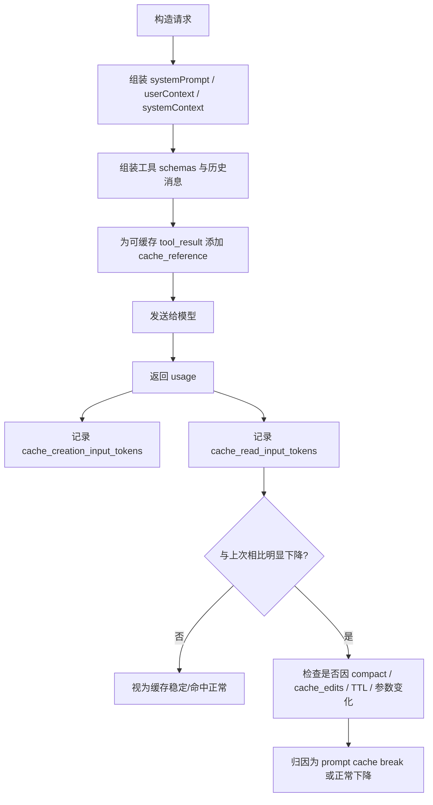

## 1. 什么是 Prompt Cache

**Prompt Cache** 可以理解为：**模型服务端对“请求前缀”进行缓存复用的一种机制**。

在 Claude Code 里，一次请求发给模型时，通常会包含大量重复内容，例如：

- 系统提示词
- 工具定义（tool schemas）
- 用户上下文
- 系统上下文
- 会话历史中的稳定前缀
- 某些可缓存的 `tool_result`

如果这些内容在连续请求之间**保持足够稳定**，服务端就不必每次都重新处理整段前缀，而可以直接复用之前的缓存结果。

从“模型底层视角”看，真正有价值的不是缓存字符串本身，而是缓存 Transformer 在 prefill 阶段算出来的 KV Cache，也就是每层 attention 的 key/value 中间状态。OpenAI 文档也提到，扩展缓存会持久化 key/value tensors，而不是持久化原始 prompt 文本。

从代码实现看，Claude Code 不只是“使用”这个能力，它还专门围绕它做了大量“**缓存稳定性工程**”，例如：

- 保持 system prompt 分段稳定
- 尽量避免工具描述频繁变化
- 为工具结果加 `cache_reference`
- 在 fork 子 agent 时构造**字节级一致**的前缀
- 对一些动态开关做“sticky / latched”处理，避免中途切换把缓存打爆

相关实现可以参考：

- `promptCacheBreakDetection.ts`
- `claude.ts`
- `state.ts`
- `systemPromptSections.ts`

---

## 2. 它到底缓存的是什么

严格来说，Claude Code 里的 prompt cache **不是本地内存缓存一段字符串**，而是**与模型请求结构直接相关的服务端前缀缓存**。

从实现语义看，Claude Code 重点维护的是以下几类内容的稳定性：

- **系统提示前缀**
- **工具 schema 列表**
- **上下文块**
- **历史消息中的稳定部分**
- **被标记为可引用的 `tool_result`**

代码里有一个非常关键的注释，明确说这些内容构成了 API cache-key prefix：

- `queryContext.ts`

其中提到会构建：

- `systemPrompt`
- `userContext`
- `systemContext`

这些共同构成缓存命中的关键前缀。

---

## 3. 它的核心作用是什么

### 3.1 降低重复上下文的处理成本

Claude Code 是一个多轮、工具驱动、上下文很重的代理系统。很多请求之间，高比例内容其实是重复的：

- 同一会话下的 system prompt 基本不变
- 工具集合通常也不变
- 很多历史消息前缀不变
- 子 agent 经常继承父上下文

没有 prompt cache 时，这些东西每次都要“重新吃一遍”。

有了 prompt cache 之后，模型侧可以直接复用稳定前缀，带来：

- **更少的重复计算**
- **更快的响应**
- **更低的上下文重处理成本**
- **更好的长会话体验**

---

### 3.2 支撑重度 agentic 工作流

Claude Code 不是简单聊天，而是：

- 连续多轮
- 大量工具调用
- 经常生成/读取长文件
- 经常派生 subagent / fork agent
- 经常 compact、resume、继续推理

这种场景里，如果没有 prompt cache，随着上下文变大，性能和成本压力会非常明显。

因此 prompt cache 本质上是在解决：

> **“代理式、多轮、重上下文工作流中的重复前缀处理成本”**

---

### 3.3 提升 fork / 子 agent 的性价比

在 `AgentTool/prompt.ts` 里直接写到：

- **Forks are cheap because they share your prompt cache**

也就是说，fork 子 agent 之所以“便宜”，一个很重要的原因就是它能尽量复用父对话的缓存前缀。

这不是口号，代码实现也专门围绕它做了设计：

- `forkSubagent.ts`
- `runAgent.ts`

---

## 4. Claude Code 如何“看见”缓存是否生效

Claude Code 会读取 API usage 里的两个关键指标：

- `cache_creation_input_tokens`
- `cache_read_input_tokens`

可以从这些实现看到：

- `tokens.ts`
- `bootstrap/state.ts`
- `statuslineSetup.ts`

### 指标含义

### `cache_creation_input_tokens`

表示：

- **本次请求中，有多少输入 token 被“写入缓存”**

你可以把它理解为：

- 这次把某段稳定前缀“热起来”了
- 后续相似请求可能复用它

---

### `cache_read_input_tokens`

表示：

- **本次请求中，有多少输入 token 是直接从缓存中读出来复用的**

这通常更能说明：

- **当前请求是否真正命中了缓存**
- 命中的规模有多大

---

### 一个简单理解方式

- **creation**：这次在“建缓存”
- **read**：这次在“吃缓存”

---

## 5. Claude Code 是怎么接入这个能力的

从 `claude.ts` 的请求构造逻辑看，Claude Code 会在合适的位置加上缓存相关标记。

一个关键点是：它会给位于缓存前缀内的 `tool_result` 添加 `cache_reference`：

```ts
msg.content[j] = Object.assign({}, block, {
  cache_reference: block.tool_use_id,
})
```

并且实现里明确要求：

- `cache_reference` 必须位于最后一个 `cache_control` 标记之前或之上
- Claude Code 为避免边界问题，采用了更保守的“严格位于之前”策略

这说明它不是抽象讨论缓存，而是在**请求 payload 级别**主动参与缓存结构构造。

---

## 6. 它解决了什么问题

## 6.1 解决“长会话重复前缀反复重算”

这是最直接的问题。

Claude Code 一轮又一轮地向模型发送请求时，前缀通常很大，但变化往往只发生在尾部：

- 新增一条用户消息
- 新增一批工具结果
- 新增一个 assistant 响应

真正变化的，常常只是最后一小段；真正重复的，却是前面那大段稳定内容。

prompt cache 解决的，就是这类**高重复前缀**问题。

---

## 6.2 解决“多 agent / fork 场景的重复上下文成本”

Claude Code 有很多分叉执行场景：

- fork 自己
- 派生 subagent
- side question
- 背景 summarization
- 某些 resume / replay 场景

这些路径如果每次都完整重建 prompt，会很浪费。

所以代码里会专门做“cache-safe params”构建，尽量让这些派生请求与主链前缀保持一致，从而复用缓存。

可以参考：

- `queryContext.ts`
- `runAgent.ts`

---

## 6.3 解决“动态系统组件导致缓存频繁失效”

Claude Code 有很多天生动态的部分，例如：

- agent 列表可能变化
- MCP tools 可能连接/断开
- beta headers 可能切换
- 工具描述可能因为插件加载而变化

如果这些动态信息直接放在 prompt 前缀中，每次变动都会打爆缓存。

因此代码里做了很多专门优化，例如：

### 例子：agent list 不再内嵌到工具描述里

在 `AgentTool/prompt.ts` 中有明确注释：

- 动态 agent list 曾显著影响 cache creation tokens
- 为避免工具 schema 因 agent 列表变化而频繁变化，改成通过 attachment 注入

这本质上就是：

> **把高波动内容从缓存敏感前缀里移出去**

这是非常经典的缓存工程思路。

---

## 7. 什么场景下会触发缓存命中

下面这些场景，通常更容易命中 prompt cache。

## 7.1 同一会话内连续提问，前缀几乎不变

这是最常见情况。

例如：

1. 你问一个问题
2. 模型调用了一些工具
3. 你接着追问一句
4. system prompt、tool schemas、上下文大部分都没变

这时缓存命中概率通常较高。

---

## 7.2 fork 子 agent，且显式保持前缀字节一致

Claude Code 的 fork 路径非常在意这一点。

在 `forkSubagent.ts` 中有很关键的实现说明：

- 为了 prompt cache sharing，fork children 要产生**byte-identical API request prefixes**
- 父 assistant 消息保留完整内容
- 对所有 `tool_use` 统一构造成相同 placeholder 的 `tool_result`
- 只有最后的 directive 文本不同

也就是说，fork 不是“语义上差不多就行”，而是尽量做到：

**前缀字节级一致**

这是 prompt cache 设计里最工程化、也最讲究的一点。

---

## 7.3 side question / 派生查询沿用主链 cache-safe 参数

`queryContext.ts` 里写得很明确：

- fallback 参数构造会尽量镜像主循环的 system prompt 组装逻辑
- 目标就是让 rebuilt prefix 尽可能匹配主链将要发送的内容
- 以保留 cache hit

这说明 Claude Code 在很多“分支请求”上都试图维护前缀兼容性。

---

## 7.4 工具结果稳定重放

在 `toolResultStorage.ts` 中，工具结果替换有一个核心原则：

- 结果一旦决定替换或不替换，它的“命运”就冻结
- 已替换的结果后续使用**完全相同的 replacement string**
- 不重新生成，不重新 I/O，保持 byte-identical

目的就是：

- **避免同一历史内容在后续 turn 中变来变去**
- **保护 prompt cache 稳定性**

---

## 8. 什么场景下会失效

这是最关键的一部分。

Claude Code 专门做了 prompt cache break detection，检测和归因逻辑在：

- `promptCacheBreakDetection.ts`

它会比较前后请求的状态和 `cache_read_input_tokens` 变化，并判断是不是发生了明显 cache break。

### 代码中的判定逻辑

如果出现：

- `cache_read_input_tokens` 相比上次下降超过 5%
- 且绝对下降量超过 `2_000` tokens

就会认为可能发生了 cache break。

---

## 9. 常见失效原因

## 9.1 Model 改了

如果模型变了，缓存通常就不能复用。

代码里会明确记录：

- `modelChanged`

这是最直接的缓存失效原因之一。

---

## 9.2 System Prompt 变了

如果 system prompt 内容变化，缓存前缀自然也会变。

代码里跟踪：

- `systemPromptChanged`
- `systemCharDelta`

另外 `systemPromptSections.ts` 还专门提供了：

- `DANGEROUS_uncachedSystemPromptSection(...)`

并且注释明确写着：

- **This WILL break the prompt cache when the value changes.**

也就是说，系统设计者非常清楚：

> **system prompt 的动态部分，是最容易打爆 prompt cache 的地方之一。**

---

## 9.3 工具 schema 变了

如果工具集合变化或工具定义变化，也会导致缓存失效。

检测项包括：

- `toolSchemasChanged`
- `addedToolCount`
- `removedToolCount`
- `changedToolSchemas`

这是 Claude Code 非常敏感的一类变化，因为工具定义通常出现在请求前缀中。

典型触发场景：

- MCP 工具连接成功后工具列表变化
- 插件热加载
- agent 列表变化导致工具描述变化
- 某个工具 description / input schema 变化

---

## 9.4 cache_control 变化

代码里会额外跟踪：

- `cacheControlChanged`

注释里明确指出它会捕捉：

- scope flip
- TTL flip

也就是：

- 缓存范围变了
- TTL 配置变了

哪怕 prompt 文本本身没变，这种控制信息变化也可能导致缓存失效。

---

## 9.5 Global Cache Strategy 变化

代码里跟踪：

- `globalCacheStrategyChanged`

注释说明它可能因 MCP tools 的发现/移除而变化。

这说明缓存不仅取决于文本本身，还取决于更高层的缓存策略。

---

## 9.6 Beta Headers 变化

代码里跟踪：

- `betasChanged`

例如某些 beta header 的增加或删除，也会改变请求结构。

为了避免这种问题，Claude Code 在 `state.ts` 里做了多种 **sticky-on latch** 设计，例如：

- `afkModeHeaderLatched`
- `fastModeHeaderLatched`
- `cacheEditingHeaderLatched`
- `thinkingClearLatched`

这些 latch 的核心思路是：

> **一旦某个 header/模式在会话里被启用过，就继续保持发送，避免中途开/关反复导致缓存失效。**

这非常巧妙。

---

## 9.7 fast mode / auto mode / effort / extra body params 变化

检测项还包括：

- `fastModeChanged`
- `autoModeChanged`
- `effortChanged`
- `extraBodyChanged`
- `cachedMCChanged`
- `overageChanged`

说明 prompt cache 的稳定性不只受消息内容影响，也受一些请求参数影响。

尤其是：

- `extraBodyParams`
- `effort`
- 某些内部 headers / body 参数

这些哪怕用户看不到，也会影响缓存键。

---

## 9.8 长时间闲置，TTL 过期

代码中明确写了两个 TTL 判断阈值：

- 5 分钟
- 1 小时

对应常量可在 `promptCacheBreakDetection.ts` 看到：

- `CACHE_TTL_5MIN_MS`
- `CACHE_TTL_1HOUR_MS`

当请求间隔过长时，Claude Code 会把 cache break 解释为：

- `possible 5min TTL expiry`
- `possible 1h TTL expiry`

另外在 `SleepTool/prompt.ts` 中也明确提到：

- **prompt cache expires after 5 minutes of inactivity**

也就是说，**闲置时间过长** 是非常实际的缓存失效来源。

---

## 9.9 有时即使你没改 prompt，也可能 miss

代码里还专门处理了一种情况：

- prompt 没变
- 间隔没超过 5 分钟
- 但 `cache_read_input_tokens` 明显下降

这类情况会被标注为：

- `likely server-side (prompt unchanged, <5min gap)`

也就是可能存在：

- 服务端路由差异
- 服务端淘汰
- 计费/推理统计不完全一致
- 其他服务端行为差异

这很重要，因为它说明：

**prompt cache 不是 100% 由客户端可控。**

---

## 10. 什么场景下“看起来像失效”，其实是正常行为

Claude Code 在这方面做得很细，不是看到 `cache_read_input_tokens` 降了就一律判错。

## 10.1 Compaction 之后

在 `promptCacheBreakDetection.ts` 中有：

- `notifyCompaction(...)`

注释明确说：

- compact 合法地减少了 message 数量
- 下一次 `cache_read_input_tokens` 下降是正常的
- 不应被视为 cache break

因为 compact 本来就会改写上下文结构。

---

## 10.2 Cached microcompact 发送 cache_edits 删除时

同一个文件里还有：

- `notifyCacheDeletion(...)`

其含义是：

- cached microcompact 会故意删除一部分缓存前缀
- 因此 cache read 下降是预期行为
- 不应误报为 cache break

说明 Claude Code 对“缓存变化”和“缓存异常”分得很清楚。

---

## 11. Claude Code 为什么如此在意“字节稳定”

这是整个设计中最值得注意的一点。

系统里反复出现类似表述：

- byte-identical
- same wire prefix
- preserve prompt cache
- don't mutate input
- frozen decisions

这说明 Claude Code 追求的不是：

- “语义差不多”
- “大致相同”

而是：

- **尽可能让发给模型的请求前缀保持字节稳定**

为什么？

因为 prompt cache 的复用通常对**请求结构一致性**极其敏感。

所以你会看到它做了很多工程动作：

- fork 子 agent 使用统一 placeholder
- tool result replacement 结果冻结
- sticky headers 避免来回切换
- 动态 agent list 从 tool description 移到 attachment
- system prompt section 做缓存
- side question 尽量复用主链 prompt 组装路径

这套设计思想可以概括成一句话：

> **任何会让请求前缀波动的动态因素，都应尽量被隔离、缓存、冻结或外移。**

---

## 12. 一个直观流程图



---

## 13. 从工程角度看，它的巧妙之处

## 13.1 它缓存的不是“回答”，而是“请求前缀”

这和很多人想象中的缓存不同。

很多人会以为缓存的是：

- 某个问题的答案

但 Claude Code 更在意的是：

- **大模型请求中大量重复的前缀上下文**

这更适合 agent 工作流。

---

## 13.2 它不是单点功能，而是全链路约束

prompt cache 并不是某个文件里一个开关那么简单。

Claude Code 里几乎是一整套策略共同协作：

- prompt 分段缓存
- 工具 schema 稳定化
- 动态内容外移
- tool_result 引用化
- fork 前缀模板化
- sticky headers
- break detection
- compaction 特殊处理

这说明它已经上升为**架构层能力**。

---

## 13.3 它特别重视“不要误伤”

一个成熟设计，不只是会报错，还要知道什么时候**不该报错**。

Claude Code 在这方面做得很好：

- compact 后的下降不算 break
- cache_edits 后的下降不算 break
- TTL 过期会单独归因
- haiku 等模型还会排除特殊行为差异

说明它不是粗糙地“看到 miss 就报警”，而是认真做了归因治理。

---

## 14. 实际使用中，哪些操作最容易把缓存打爆

下面列一个最实用的工程经验版清单。

### 高风险操作

- **切换模型**
- **修改 system prompt**
- **修改 appendSystemPrompt / customSystemPrompt**
- **工具集合变化**
- **工具 schema / description 变化**
- **MCP 工具连接状态变化**
- **动态 agent list 直接嵌入工具描述**
- **切换影响 cache_control 的策略或 TTL**
- **中途切换 beta headers**
- **更改 extra body params**
- **长时间闲置超过 TTL**

---

### 中风险操作

- **compaction**
- **cached microcompact 删除缓存片段**
- **resume 后上下文重建方式不同**
- **fork / subagent 没有严格复用父前缀**

---

### 低风险或优化型做法

- **稳定 system prompt 分段**
- **将高波动内容挪到 attachment**
- **冻结 tool result replacement**
- **保持 fork child 前缀 byte-identical**
- **对会话级 header 采用 sticky-on 策略**

---

## 15. 最后给一个简单结论

### 如果只用一句话解释

**Claude Code 的 prompt cache，本质上是为了复用连续请求中高度重复的提示前缀，从而降低长会话、多工具、多 agent 工作流中的重复上下文处理成本。**

---

### 如果再展开一点

它解决的是：

- 长会话里反复发送巨大前缀
- subagent / fork 重复继承上下文
- 动态工具与系统配置导致缓存频繁失效
- compaction 与工具结果替换对缓存稳定性的破坏风险

它之所以做得好，不在于“用了缓存”，而在于它围绕缓存构建了一整套**前缀稳定性工程**。

---
