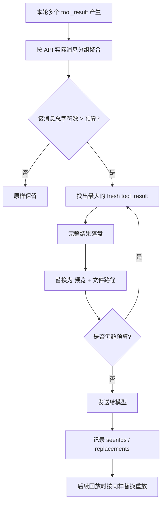

## 一句话先说结论

**`MAX_TOOL_RESULTS_PER_MESSAGE_CHARS` 不是“单个工具输出上限”，而是“单轮消息级别的总预算上限”。**

它的目标是：

- **防止并行工具调用时，多个“各自合法”的结果叠加后，单轮消息整体过大**
- **在不破坏对话一致性、缓存稳定性、恢复能力的前提下，把超预算内容自动落盘并替换为预览**
- **精准治理“这一轮太胖”的问题，而不是粗暴压缩整个历史上下文**

---

## 这个常量到底管什么

从 `toolLimits.ts` 的注释可以看出，它约束的是：

- **单个 user message 内所有 `tool_result` block 的字符总量**
- 这里的“单个 user message”不是用户肉眼看到的一条自然语言输入
- 而是 **一次 turn 中，由多个并行工具结果拼出来并最终发给模型的一次消息载荷**

也就是说，它关注的是：

> **这一轮发送给模型的工具结果合计有多大**

而不是：

> 某一个工具结果是否过大

---

## 为什么需要这个设计

### 1. 单工具限流不够，挡不住“并发叠加”

系统里已经有单工具级别的上限，例如：

- `DEFAULT_MAX_RESULT_SIZE_CHARS = 50_000`

这能控制：

- 某一个工具输出过大时，单独落盘替换预览

但它**解决不了并行场景**：

- 工具 A：40K
- 工具 B：40K
- 工具 C：40K
- 工具 D：40K
- 工具 E：40K

每个工具都**没有超单工具阈值**，理论上都“合法”，但一轮加起来已经 **200K** 了。

如果并行再多一点，比如注释里举的例子：

- **10 × 40K = 400K**

那模型收到的这一轮消息会异常肥大，直接带来：

- 上下文膨胀
- token 消耗激增
- 推理效率下降
- prompt cache 命中率下降
- 后续 compact / snip 压力增大

所以这里的关键洞察是：

**“局部约束成立，不代表全局约束成立。”**

---

### 2. 真正危险的是“同一轮爆炸”，不是“跨轮累计”

这个设计没有做“全会话累计上限”，而是特意定义成：

- **per message**
- **单条消息独立评估**

注释里明确说明：

- 一轮 150K，没超，不处理
- 下一轮再来 150K，也没超，仍不处理

这说明设计者刻意避免了“跨轮追杀”。

原因很重要：

- 模型实际压力最大的，是**某一次发送时的瞬时载荷**
- 两轮各 150K，虽然累计 300K，但**不是同一次注入**
- 如果做全局累计，会导致系统不断回头修改旧消息，破坏对话稳定性

因此，它治理的是：

**单轮峰值（peak）**

而不是：

**长期累计（total）**

这是一个非常成熟的工程判断。

---

## 它解决的典型问题场景

## 1. 并行工具一起返回，单轮消息超胖

最典型场景：

- 搜索工具返回 30K
- 网页抓取工具返回 45K
- 文件读取工具返回 60K
- 日志分析工具返回 55K

单看都未必触发单工具落盘，但这一轮合计已经 **190K+** 甚至更高。

此时如果再有一点附加文本，很容易把消息推到极重。

`MAX_TOOL_RESULTS_PER_MESSAGE_CHARS` 就是专门拦这个口子。

---

## 2. 中途中断 / 并行返回顺序复杂，最终线上 wire message 被合并后才超限

这是实现里一个非常巧妙的点。

在 `toolResultStorage.ts` 的注释中提到：

- 发送给 API 前，消息会经过 `normalizeMessagesForAPI`
- 一些原本在内部状态里分散的 user message，会在真正上行时**合并**
- 尤其是并行工具返回期间，可能夹杂 `agent_progress` 之类消息
- 这些消息**不应该打断预算分组**

如果预算检查只是“按本地状态逐条看”，会出现一个危险 bug：

- 本地看，每条都不超
- 真正发给模型时，被合并成一条超大的 wire message
- 结果预算机制失效

所以它不是简单遍历 message array，而是模拟 API 侧的消息归并方式来做分组判断。

**这很高级。**

因为它防守的是：

**“本地结构看起来安全，但上线后的真实传输形态不安全”**

这是很多系统容易忽略的层次。

---

## 3. 避免后续自动压缩链路承受额外压力

在 `query.ts` 中可以看到，这个预算控制运行在：

- **microcompact 之前**

这意味着它的职责不是“善后”，而是“前置削峰”。

好处是：

- 先把最重的工具结果换成预览
- 后面的 compact / token budget 机制面对的是更健康的输入
- 整体上下文管理变得分层而不是互相打架

换句话说，它像一个**入口限流器**，不是末端清理器。

---

## 为什么设计成“替换最大块直到回到预算内”

代码语义显示：

- 如果某条消息超预算
- 就优先挑出其中**最大的、且是 fresh 的** `tool_result`
- 将其落盘
- 用预览字符串替换
- 直到该消息低于预算

这背后的设计很聪明：

### 1. 最小化干预面

不是把整条消息全压缩，也不是每个块都截断一点。

而是：

- **优先替换最大的块**
- 用最少的替换次数回收到预算内

这有几个好处：

- 保留更多原始中小结果
- 保留消息结构的可读性
- 减少替换数量，降低行为复杂度

本质上这是一个很实用的贪心策略：

> **优先移除“最胖”的那几个块，成本最低，收益最大。**

---

### 2. 尽量保留“信息多样性”

如果平均截断所有工具结果，每个结果都会变残缺。

而替换最大块的策略通常意味着：

- 小结果完整保留
- 大结果只保留预览与文件路径

这样模型仍然能看到：

- 多个工具的结论
- 各个结果的开头上下文
- 如果需要，可以再读落盘文件

因此不是“信息消失”，而是**从 inline 展示变成 deferred access**。

---

## 为什么是 200,000 而不是别的数字

代码里没有给出数学证明式推导，但从上下文能推断出它是一个**工程折中值**。

可以从三个层面理解：

### 1. 它明显高于单工具默认阈值 50,000

- 单工具默认阈值：`50_000`
- 单消息聚合阈值：`200_000`

这意味着系统允许：

- 一轮里出现多个中等偏大的工具结果
- 但不允许它们无限叠加

也就是说，它不是保守到“一有并行就截”，而是允许一定并行吞吐。

---

### 2. 它大约相当于“4 个默认上限工具结果”的量级

\(200,000 / 50,000 = 4\)

这很像一种经验化容量设计：

- 允许一个 turn 中出现若干中型结果
- 但当数量或总量明显失控时才触发治理

这能减少误伤。

---

### 3. 它以“字符数”做近似，是为了低成本治理

实现中对内容大小的判断是基于字符长度或文本块长度求和，而不是精确 tokenizer 计数。

原因很现实：

- token 精确计算成本更高
- 每轮都精确 token 化不划算
- tool result 预算本身就是粗粒度削峰，不需要过度精确

所以这里采用的是：

**低成本、足够准的工程近似**

这也是好设计的特征之一。

---

## 它最巧妙的地方在哪里

下面这几个点，我认为是这套设计最值得称赞的地方。

## 1. “命运冻结”机制：一旦看过，就不改主意

在 `toolResultStorage.ts` 中，状态通过 `tool_use_id` 追踪：

- `seenIds`
- `replacements`

核心原则是：

- **某个结果一旦被系统“看过”并作出决定，它之后的处理命运就冻结**
- 以前替换过的，后续继续用同一个替换结果
- 以前没替换过的，后续也不会“补刀替换”

为什么这很重要？

因为如果系统后面又回头说：

- “之前没替换，现在我想替换了”

就会带来两个严重问题：

- **破坏 prompt cache**
- **让模型看到的历史上下文发生回溯性变化**

这会影响：

- 对话一致性
- resume/replay 稳定性
- 缓存命中

所以这里的理念不是“当前最优压缩”，而是：

**“一旦发给模型，就不能随便改历史。”**

这非常像数据库中的不可变事件流思维。

---

## 2. 替换内容是可复用、字节级一致的

已经替换过的结果，后续不会重新生成摘要或重新读盘拼字符串，而是直接复用缓存好的 preview replacement。

这有两个收益：

- **零额外 I/O**
- **字节级一致，保证 cache 稳定**

这是个很细，但非常工程化的优化点。

很多系统会只关注“功能实现”，但这里连“重复执行时内容是否完全一致”都考虑到了。

---

## 3. 与 API 消息归并逻辑对齐，而不是只看内部状态

这是前面提到的另一个亮点。

预算判断不是拍脑袋按“消息数组元素”做，而是按**真正上线发送给模型的分组语义**做。

这说明设计者理解的不只是业务逻辑，而是：

- 内部状态结构
- API 线协议形态
- 并发返回时的边界条件
- 中断恢复时的消息组合方式

这种“按真实消费端语义约束生产端”的设计，非常成熟。

---

## 4. 与其他预算系统是“分层协作”，不是互相覆盖

系统里其实有多层预算：

- 单工具结果阈值
- 单消息聚合阈值
- token budget
- compact / microcompact
- 可能的其他摘要和裁剪策略

`MAX_TOOL_RESULTS_PER_MESSAGE_CHARS` 所处的位置很清晰：

- **不替代单工具限额**
- **不替代 token budget**
- **不替代 compact**
- **而是在它们之间补上“并发聚合”这个空档**

这就是典型的**分层防线**思想。

---

## 一个直观例子

### 场景 A：没有这个机制

一轮并行返回：

- `ReadFile`：48K
- `WebSearch`：42K
- `Grep`：36K
- `FetchLogs`：51K

即使其中某些接近阈值，只要没单独超很多，可能仍然大量原样进入消息。

最终这一轮用户消息体量会非常大，导致：

- 模型上下文被瞬时挤爆
- 后续推理变慢
- 重要指令被稀释
- token 成本飙升

---

### 场景 B：有这个机制

同样的结果进入后，系统发现该轮超出 `200_000`。

于是它会：

- 找出最大块
- 落盘保存完整结果
- 用“文件路径 + preview”替代
- 若仍超限，再处理下一个最大块
- 直到该轮消息回到预算内

模型最终看到的是：

- 关键信息预览
- 明确的完整结果存储位置
- 其余中小型结果仍原样保留

效果就是：

**既控体积，又不牺牲可追溯性。**

---

## 设计上的取舍

任何预算系统都不是“越严越好”，这里也有明显取舍。

### 1. 不做跨消息累计治理

- **优点**：稳定、不回溯、不误伤历史
- **代价**：长会话总体上下文仍可能变大，需要交给 compact/token budget 处理

---

### 2. 用字符数而非精确 token 数

- **优点**：便宜、快、实现稳定
- **代价**：只是近似，不是绝对精确

---

### 3. 优先替换大块，而不是做语义压缩

- **优点**：简单、可预测、结果稳定
- **代价**：不是最“聪明”的语义保真方案

但在基础设施层，这种选择通常是对的：

**先保证稳定和确定性，再追求智能化。**

---

## 运行时可调：为什么这也是设计亮点

代码里有 `getPerMessageBudgetLimit()`，并且支持通过 GrowthBook flag：

- `tengu_hawthorn_window`

动态覆盖默认值。

这说明这个常量虽然写死为 `200_000`，但系统设计并没有把它当成不可变真理，而是：

- **默认值提供安全基线**
- **线上可按实验/灰度/不同模型窗口动态调节**

这很关键，因为最优预算受很多因素影响：

- 模型上下文窗口
- prompt cache 行为
- 常见工具输出形态
- 线上成本目标
- 不同功能链路的容忍度

因此真正成熟的做法不是死磕一个神奇数字，而是：

**把默认值固化，把调优能力外置。**

---

## 流程图

---

## 这套设计最核心的价值

可以浓缩成四句话：

- **它补上了“单工具限额”与“全局 token 控制”之间的空白层。**
- **它处理的是并发聚合后的瞬时峰值，而不是历史累计。**
- **它通过“命运冻结”保证上下文稳定、缓存稳定、恢复稳定。**
- **它采用最少干预策略，把大输出从 inline 变成 referenced，而不是简单粗暴删除。**

---

## 适合怎么理解它

如果用架构角色来比喻：

- `DEFAULT_MAX_RESULT_SIZE_CHARS` 像**单车限重**
- `MAX_TOOL_RESULTS_PER_MESSAGE_CHARS` 像**收费站总车道限流**
- `token budget / compact` 像**整条高速的总流量治理**

三者不是重复，而是不同层面的防线。

---

## 最后的判断

**`MAX_TOOL_RESULTS_PER_MESSAGE_CHARS` 的巧妙之处，不在于“设了 200K 这个数”，而在于它识别出了真正的问题边界：并行工具结果在单轮消息上的聚合爆炸。**

并且它用一种非常工程化的方式解决了这个问题：

- 粒度选得准
- 干预时机选得准
- 与消息归并语义对齐
- 对缓存和恢复极其友好
- 默认值与运行时动态调优兼容

所以这不是一个普通的“常量阈值”，而是一个**消息层预算治理机制的核心参数**。
