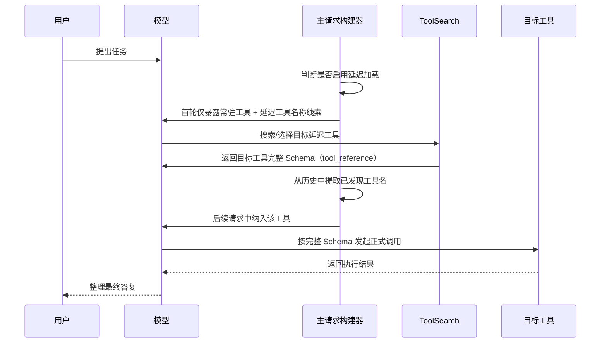

## 工具延迟加载机制详解

### 一、概述

这套机制的核心目标是：

**不要在请求一开始就把所有工具的完整定义都塞给模型，而是先只暴露“可发现性”，等模型确定真的需要某个工具时，再把该工具的完整 Schema 渐进式补进上下文。**

在这个项目里，这套能力主要围绕以下几处实现展开：

- `ToolSearchTool.ts`
- `prompt.ts`
- `toolSearch.ts`
- `Tool.ts`
- `claude.ts`
- `api.ts`
- `attachments.ts`

---

## 二、什么是“延迟加载”

### 2.1 定义

在该项目中，一个工具如果被判定为 **deferred tool**，它就不会在首轮请求里以“完整可调用工具”的形式直接提供给模型，而是采用如下方式暴露：

- **先让模型知道有这个工具存在**
- **但暂时不给它完整参数 Schema**
- **只有模型明确检索/选择后，才把完整定义补充进来**
- **补充后，该工具才像普通工具一样可调用**

这是一种典型的**渐进式加载（progressive loading）**。

---

## 三、哪些工具会被延迟加载

### 3.1 类型系统层面的标记

在 `Tool.ts` 中，工具定义本身就支持两个关键字段：

- `shouldDefer?`
- `alwaysLoad?`

其中注释已经明确说明：

- `shouldDefer: true` 表示该工具应被延迟加载
- `alwaysLoad: true` 表示该工具永不延迟，必须首轮就完整暴露

### 3.2 真正的判定逻辑

在 `prompt.ts` 中，`isDeferredTool(tool)` 才是最终判定入口。

它的核心规则可以概括为：

- **`alwaysLoad === true` 的工具永不延迟**
- **MCP 工具默认都延迟加载**
- **`ToolSearch` 自己绝不能延迟**
- 某些必须首轮可见的通信/协调类工具也会被排除在延迟之外
- 其余工具若设置了 `shouldDefer: true`，则进入延迟池

### 3.3 例外工具为什么不能延迟

代码里专门豁免了几类工具，原因非常明确：

- **`ToolSearch` 本身**
  - 因为它是“加载其他延迟工具”的入口
  - 如果连它都被延迟，就会出现“用什么来加载它自己”的悖论

- **Agent/Fork 类首轮必须可用的工具**
  - 某些调度/子代理能力必须在第一轮就能执行
  - 否则系统的主协作流程会被卡住

- **Brief / SendUserFile 这类沟通通道**
  - 这类工具承载了和用户交互、可见性约束、文件投递等关键能力
  - 不能为了节省上下文而牺牲首轮可达性

---

## 四、为什么要这么设计

### 4.1 直接原因：工具太多，完整注入成本太高

项目注释已经明确指出，延迟加载要解决的是：

**“工具定义本身就会占掉大量上下文 Token，而且很多工具在当前任务里根本不会用到。”**

尤其是两类工具最典型：

- **MCP 工具**
  - 往往来自外部服务、插件或服务器
  - 数量多、场景强相关、并不总是需要
- **某些高级内建工具**
  - 功能较专门，平时不一定用到
  - 但其描述和输入 Schema 依然会持续消耗上下文

### 4.2 更深一层的原因：减少 Prompt 污染

如果把所有工具完整放进首轮上下文，会产生几个副作用：

- 模型要在大量工具中做选择，**决策噪声变大**
- 真正高频工具被淹没，**首轮命中率下降**
- 整个系统 Prompt 体积变大，**压缩用户有效上下文**
- 工具集合一变化，完整工具数组就变化，**缓存更容易失效**

### 4.3 还有一个重要动机：支持“动态工具池”

MCP 服务可能会出现以下情况：

- 某些服务器还在连接中
- 某些服务器中途连上
- 某些插件被热更新
- 某些工具在不同权限模式下可见性不同

如果采用“首轮一次性静态注入全部工具”的模式，就很难优雅支持这种动态变化。

延迟加载机制把问题分成两层：

- **名字层**：告诉模型“当前有哪些延迟工具存在”
- **Schema 层**：只有在真正需要时才把定义发给模型

这样就能很好适配动态工具池。

---

## 五、它解决了什么问题

### 5.1 上下文成本问题

- **减少首轮工具描述占用的 Token**
- **把上下文留给用户问题、代码、历史消息**
- 在 `tst-auto` 模式下，还能根据阈值自动决定是否启用延迟加载

### 5.2 大规模工具池问题

在 `toolSearch.ts` 里，注释写得很直接：

- 不再需要预声明全部 MCP 工具
- 也减少了工具数量上限带来的压力

也就是说，它本质上是在把“全量预注入”改造成“按需发现 + 按需引入”。

### 5.3 动态连接问题

对于尚未连接完成的 MCP server，系统不会假装它们已经完全可用，而是：

- 在搜索不到时返回 `pending_mcp_servers`
- 等服务真正连上后，再通过增量信息让模型知道新工具出现了

### 5.4 缓存稳定性问题

在 `attachments.ts` 的相关注释里，能看到设计思路：

**把“动态变化的信息”从静态工具描述中剥离出去，尽量让工具描述本身保持稳定。**

这样做的结果是：

- 工具描述更稳定
- 缓存命中率更高
- 因工具列表波动导致的整段 schema cache 失效更少

---

## 六、核心设计拆解

### 6.1 三层暴露模型

这套机制可以理解为三层：

- **第 1 层：名称可见**
  - 模型先知道有哪些工具“存在”
  - 但还不知道参数结构

- **第 2 层：Schema 可见**
  - 模型通过 `ToolSearch` 选择某个工具后
  - 系统返回该工具的完整 JSON Schema

- **第 3 层：正式调用**
  - 只有完整 Schema 出现在上下文后
  - 模型才能像普通工具一样正确构造参数并调用

### 6.2 三种模式

在 `toolSearch.ts` 中，系统定义了三种模式：

- **`tst`**
  - 始终启用 Tool Search
  - 延迟工具统一通过搜索发现

- **`tst-auto`**
  - 自动模式
  - 当延迟工具的总成本超过阈值时启用

- **`standard`**
  - 关闭延迟加载
  - 所有工具正常直接暴露

### 6.3 自动阈值策略

默认阈值是：

- **上下文窗口的 10%**

系统会优先尝试：

- **精确 Token 统计**

如果拿不到精确值，就退化为：

- **按字符数估算**

这说明设计者非常关注**收益是否值得**：
不是无脑启用延迟加载，而是让它在“工具定义过大”时再介入。

---

## 七、从请求构造角度看完整机制

### 7.1 第一步：判断是否启用延迟加载

在 `claude.ts` 中，系统会先调用 `isToolSearchEnabled(...)`。

它会综合判断：

- 当前模式是否允许
- 当前模型是否支持 `tool_reference`
- `ToolSearch` 自身是否在可用工具列表里
- 自动模式下是否超过阈值

如果不满足条件，就退回普通模式。

### 7.2 第二步：识别 deferred tool 集合

如果启用了延迟加载，系统会遍历工具池，找出所有 `isDeferredTool(tool)` 为真的工具。

也就是建立一个**延迟工具名字集合**。

### 7.3 第三步：首轮只保留必要工具

在启用延迟加载时，真正发给模型的工具列表 `filteredTools` 并不是全量工具，而是：

- 所有**非延迟工具**
- `ToolSearch` 本身
- 历史上已经被“发现过”的延迟工具

也就是说：

**没被发现过的延迟工具，不会作为完整工具 Schema 出现在当前请求里。**

### 7.4 第四步：发现过的延迟工具如何被记住

在 `toolSearch.ts` 中，`extractDiscoveredToolNames(messages)` 会扫描消息历史，提取此前 `ToolSearch` 返回过的 `tool_reference`。

一旦某个延迟工具被发现过：

- 它的名字会从历史消息中被重新提取出来
- 在后续请求里，它就能被加入 `filteredTools`

这一步很关键，它使得“加载过一次的工具”可以在后续轮次持续可用，而不用反复重新搜索。

### 7.5 第五步：Schema 序列化时挂上 `defer_loading`

在 `api.ts` 中，`toolToAPISchema(...)` 支持 `deferLoading?: boolean` 参数。

如果该参数为真，就会把：

- `schema.defer_loading = true`

写进 API 工具定义中。

这说明“延迟加载”并不只是应用层概念，而是会被**明确编码到发送给模型 API 的工具 schema** 里。

### 7.6 第六步：通过增量附件告诉模型有哪些延迟工具

在 `attachments.ts` 中，系统会生成 `deferred_tools_delta` 附件。

作用是：

- 告诉模型当前**新增了哪些延迟工具**
- 告诉模型某些工具是否已经从池里消失
- 让模型跨轮次持续知道“有哪些工具可通过 ToolSearch 获取”

这是一种**名字级别的增量广播**。

---

## 八、`ToolSearch` 本身是如何工作的

### 8.1 它解决的不是“调用工具”，而是“获取工具定义”

`ToolSearchTool.ts` 的职责不是代替目标工具完成工作，而是：

**根据名字或关键词，从 deferred tools 中找出目标工具，并返回这些工具的完整 Schema。**

### 8.2 它支持两种典型检索方式

- **精确选择**
  - `select:WebSearch`
  - `select:Read,Edit,Grep`

- **关键词搜索**
  - 比如 `web search`
  - 比如 `+slack send`

其中 `+` 前缀表示**必含词**。

### 8.3 它返回的不是普通文本，而是 `tool_reference`

`ToolSearch` 的结果会被编码为 `tool_result`，其中内容是若干 `tool_reference` 块。

这意味着：

- 返回结果并不是“解释说明”
- 而是“把目标工具的定义引用进模型上下文”

项目注释里写得很清楚：

**一旦某个工具的 Schema 出现在这个结果里，它就和一开始就在 prompt 顶部声明的普通工具没有本质区别。**

### 8.4 为什么需要搜索评分

`ToolSearch` 并不是简单做字符串包含，它还做了：

- 工具名拆分
- MCP 名称拆分
- `searchHint` 加权
- 描述词匹配
- 精确命中优先
- 必需词过滤

这让它更像一个**面向工具发现的轻量检索器**，而不是纯字面过滤器。

---

## 九、渐进式加载完整流程图

---

## 十、以 `WebSearchTool` 为例，解释完整渐进式加载流程

下面选择 `WebSearchTool.ts` 作为一个清晰的案例。

原因很简单：

- 它是一个真实内建工具
- 在定义里明确写了 `shouldDefer: true`
- 使用场景很清楚，便于说明“为什么不必首轮默认暴露”

### 10.1 工具定义阶段

在 `WebSearchTool.ts` 中可以看到：

- 工具名：`WEB_SEARCH_TOOL_NAME`
- 搜索提示：`searchHint: 'search the web for current information'`
- 明确设置：`shouldDefer: true`

这意味着它天然适合进入延迟加载池。

### 10.2 首轮请求阶段：它不会完整暴露

假设用户只是问了一个本地代码相关问题，此时系统会判断：

- `WebSearchTool` 属于延迟工具
- 当前模型支持 Tool Search
- Tool Search 模式已开启

那么在首轮请求里：

- `WebSearchTool` **不会作为完整工具 Schema 直接发给模型**
- 模型只会知道：
  - 有这么一个延迟工具存在
  - 可以通过 `ToolSearch` 去把它取出来

这样做的直接收益是：

- 首轮上下文更小
- 模型不会被大量不相关工具干扰
- 本地问题不会莫名优先联想到“上网搜索”

### 10.3 发现阶段：模型决定需要联网

如果用户的问题变成：

- “帮我查一下今天的最新发布”
- “验证一下这个依赖的最新版本”

模型会意识到当前常驻工具不够，需要联网能力。

这时它不会直接调用 `WebSearchTool`，因为它还没有完整 Schema，而是会先调用 `ToolSearch`，比如搜索：

- `web search`
- 或者直接 `select:WebSearch`

### 10.4 加载阶段：`ToolSearch` 返回它的完整定义

`ToolSearch` 检索 deferred tools 后，会把 `WebSearchTool` 的完整可调用定义返回进上下文。

从这一刻开始，模型已经获得了：

- 工具名
- 参数结构
- 参数字段说明
- 调用方式约束

于是 `WebSearchTool` 从“只知道名字”变成“真正可调用”。

### 10.5 记忆阶段：系统把它视为已发现工具

`ToolSearch` 返回的结果里包含 `tool_reference`。

后续轮次里，系统会通过 `toolSearch.ts` 中的 `extractDiscoveredToolNames(...)`，从历史消息中提取出这个名字。

结果就是：

- `WebSearchTool` 被加入“已发现延迟工具集合”
- 在后续请求中，它可以进入 `filteredTools`

也就是说：

**这个工具一旦被加载过，之后就不必每轮都重新“从零发现”。**

### 10.6 真正执行阶段：模型正式调用 `WebSearchTool`

此时模型已经掌握其完整输入结构，于是就能按 Schema 发起正式调用，例如传入：

- `query`
- `allowed_domains`
- `blocked_domains`

然后工具内部才会真正发起搜索流程。

这说明：

**“延迟加载”延迟的是工具定义进入上下文，不是工具执行本身。**

### 10.7 结果返回阶段

`WebSearchTool` 执行完成后，会把结果格式化为：

- 搜索说明文本
- 链接结果
- 来源提醒

最终由模型整合成面向用户的回答。

---

## 十一、为什么说这是“渐进式加载”而不是“懒调用”

很多人会把它理解成“用到时才执行工具”，但这个项目的设计更准确地说是：

**先延迟“工具定义的装载”，再进行“正常工具调用”。**

所以它不是单层懒执行，而是两阶段：

- **第一阶段：懒装载 Schema**
- **第二阶段：正常发起调用**

这个区分很重要，因为真正昂贵的往往不是“调用一次工具”，而是：

**把几十上百个工具的完整定义长期塞进上下文。**

---

## 十二、这套机制的关键优势

### 12.1 对模型更友好

- 首轮工具噪声更低
- 模型更容易先用高频工具解决问题
- 只有真的需要时才进入更深能力层

### 12.2 对上下文更友好

- 减少工具定义占用
- 提高上下文预算利用率
- 自动模式下还能按阈值自适应

### 12.3 对动态系统更友好

- 适配 MCP 服务异步连接
- 支持插件池变化
- 支持跨轮次增量宣布工具变化

### 12.4 对缓存更友好

- 工具描述更稳定
- 动态变化信息外移
- 降低因工具池波动导致的缓存失效

---

## 十三、这套机制的限制与边界

### 13.1 依赖模型支持 `tool_reference`

在 `toolSearch.ts` 中，系统会先判断模型是否支持 `tool_reference`。

如果模型不支持，就不能启用这套机制。

### 13.2 某些代理/网关可能不支持 beta 字段

代码里专门考虑了代理转发场景，因为：

- `tool_reference`
- `defer_loading`

都属于较新的 API 形态

某些第三方代理或网关可能会拒收这些字段，因此系统保留了降级路径。

### 13.3 不是所有工具都适合延迟

必须首轮可见、承担基础通信或系统协同职责的工具，不适合被延迟。

这也是为什么系统保留了 `alwaysLoad` 和若干硬编码豁免逻辑。

---

## 十四、一句话总结

**这套延迟加载机制，本质上是把“工具能力暴露”拆成“名字可见 → Schema 可见 → 正式调用”三步，用更少的首轮上下文成本，换取更强的工具扩展能力、更低的噪声、更好的动态适配性。**

如果只用一句话概括它的价值，那就是：

**它让系统从“把所有工具一次性塞给模型”升级成了“让模型按需发现并逐步加载工具”。**

---
