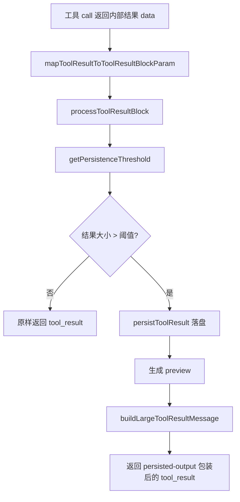

## `maxResultSizeChars` 机制技术说明

---

### 1. 背景

在这个系统里，每个工具都需要声明一个结果预算字段：

- `maxResultSizeChars: number`

它定义在 `Tool.ts` 中，语义非常明确：

- **当工具结果过大时，不直接把完整内容继续喂给模型**
- **而是将完整结果持久化到磁盘**
- **再把“文件路径 + 预览内容”返回给模型**

这不是单纯的“截断字符串”，而是一套**工具结果降载（offloading）机制**。

---

### 2. 一句话概括机制

`maxResultSizeChars` 的核心思想是：

> **大结果不硬塞进上下文，而是转存到会话目录里的文件中，只给模型一个小预览和读取路径。**

这样做的目标不是只为了“省一点字符”，而是同时解决：

- **上下文窗口被工具输出挤爆**
- **并行工具结果叠加导致单轮消息异常膨胀**
- **resume / compact / replay 时重复发送大结果**
- **prompt cache 被不稳定的大结果破坏**
- **直接截断后模型拿不到完整产物**

---

### 3. 设计动机：为什么不是简单截断？

如果只是简单把超长结果裁掉，会有几个明显问题：

#### 3.1 模型失去“完整结果可回溯性”

例如：

- `grep` 返回几万行匹配
- `bash` 执行生成超长日志
- `web_fetch` / `web_search` 拉回大段正文
- MCP 工具返回大型 JSON

如果只是截断，模型只能看到一半甚至前几百行，**完整结果就丢了**。  
而当前方案会把完整内容保存到磁盘，让模型后续仍然可以通过路径继续读取。

---

#### 3.2 大结果会持续污染后续轮次

工具结果不是只影响当前这一轮。

如果它进入 transcript：

- 下一轮 query 还会带着它
- compact / replay 时还会重复出现
- resume 时还要尽量重建一致上下文

所以一个超大 `tool_result` 的危害是**跨轮次扩散**的。  
这就是为什么这里不是一个“显示层小优化”，而是**消息级、会话级的上下文治理机制**。

---

#### 3.3 并行工具会产生“叠加爆炸”

单个工具可能不算特别大，但多个工具一起返回时会很夸张。

`toolLimits.ts` 的注释里直接点明了这个问题：

- 一个工具可能在自己范围内没超限
- 但 **N 个并行工具** 合起来可能从几十 KB 膨胀到几百 KB

这也是为什么系统除了单工具阈值，还专门实现了**单消息聚合预算**。

---

### 4. 机制总览

整个机制其实分成两层：

#### 4.1 单工具结果预算

入口是工具声明的 `maxResultSizeChars`：

- 定义位置：`Tool.ts`
- 落地处理：`toolResultStorage.ts`

作用：

- 控制**某一个工具结果块**是否需要落盘替换

---

#### 4.2 单消息聚合预算

即使每个工具都没超单工具阈值，也可能：

- 5 个工具各返回 40K
- 单个都合法
- 合起来 200K+

所以系统又有一个**每条 user message 内所有 `tool_result` 的聚合预算**：

- 常量定义在 `toolLimits.ts`
- 主逻辑在 `toolResultStorage.ts`
- 在 query 主流程里由 `query.ts` 接入

---

### 5. 单工具预算的处理流程

下面是 `maxResultSizeChars` 的主链路。



---

### 6. 核心实现链路

#### 6.1 从工具输出到 `tool_result`

在 `toolResultStorage.ts` 中：

- `processToolResultBlock(...)`
- `processPreMappedToolResultBlock(...)`

它们会先调用工具自己的：

- `mapToolResultToToolResultBlockParam(...)`

把工具内部的 `Output` 映射成真正发给模型的 `tool_result` block。

这一步很重要，因为：

- **预算检查不是对内部对象做的**
- 而是对**最终要发给模型的内容**做的

也就是说，预算约束的是**模型真实看见的内容体积**。

---

#### 6.2 阈值如何计算

真正的阈值不是简单等于工具上声明的 `maxResultSizeChars`，而是通过：

- `getPersistenceThreshold(toolName, declaredMaxResultSizeChars)`

计算出来。

优先级可以总结为：

```text
Infinity 硬退出
> GrowthBook 按工具 override
> min(工具声明值, 全局默认上限 50_000)
```

也就是：

#### **第一优先级：`Infinity`**
如果工具声明的是 `Infinity`，表示：

- **永远不做这类持久化替换**

源码里明确写了一个关键原因：

- 对 `Read` 一类工具来说，它本身已经通过别的机制限制大小
- 如果再把它的结果写到文件里，然后让模型再去读这个文件，会形成**Read → 文件 → 再 Read** 的循环

一个典型例子是：

- `FileReadTool.ts`  
  其中 `maxResultSizeChars: Infinity`

---

#### **第二优先级：按工具动态 override**
源码里用了 GrowthBook 开关：

- `tengu_satin_quoll`

它允许在线按工具名覆盖阈值。  
这意味着系统可以在不改代码的情况下：

- 单独调低某些噪音工具
- 单独放宽某些高价值工具
- 快速做线上实验

---

#### **第三优先级：全局硬上限**
即使某工具声明：

- `maxResultSizeChars: 100_000`

最终也会被全局默认值截到：

- `DEFAULT_MAX_RESULT_SIZE_CHARS = 50_000`

定义在 `toolLimits.ts`。

所以大多数工具虽然代码里写的是 `100_000`，但**实际默认阈值通常还是 50K**，除非被动态 override。

---

### 7. 超限后具体发生什么

#### 7.1 先落盘

调用：

- `persistToolResult(content, toolUseId)`

它会把结果保存到当前 session 的：

- `tool-results/`

目录下。

路径结构来自：

- `getSessionDir()`
- `getToolResultsDir()`
- `getToolResultPath(...)`

文件名以 `toolUseId` 为核心，这有两个关键价值：

- **同一次工具调用天然唯一**
- **相同消息 replay 时可复用，不重复写文件**

源码里甚至专门用 `writeFile(..., { flag: 'wx' })` 避免重复写和竞态。

---

#### 7.2 只允许持久化“纯文本结果”

如果 `tool_result` 是数组 block，代码会先检查：

- 是否包含非 `text` block

如果有图片等非文本块，会直接拒绝持久化。  
因为这套机制本质上是把结果变成：

- 文件
- 文本预览
- 路径说明

对图片、多模态 block 不适合这样做。

---

#### 7.3 生成预览

预览大小常量：

- `PREVIEW_SIZE_BYTES = 2000`

也就是不会把大结果完全隐藏，而是给模型一个小窗口：

- 看到头部预览
- 知道完整文件路径
- 知道原始输出有多大

`generatePreview(...)` 还会尽量按换行切，避免把一行从中间撕开，提升可读性。

---

#### 7.4 包装成统一提示文本

最后通过：

- `buildLargeToolResultMessage(...)`

生成一个统一格式，大致形态是：

```xml
<persisted-output>
Output too large (...). Full output saved to: /.../tool-results/xxx.txt

Preview (first ...):
...
</persisted-output>
```

这里的 `<persisted-output>` 很关键，它是一个**协议标记**：

- 后续预算系统会识别它
- transcript/search/UI 也能知道这个结果已经被“外置化”过

---

### 8. 为什么不是直接丢弃完整结果，而是保存到文件？

这是这个机制最值得注意的设计点。

#### **它本质上不是“删内容”**
而是：

- **把重内容从 prompt 搬到文件系统**
- **把 prompt 中保留成可导航、可恢复、可再读取的索引入口**

这样模型仍然可以：

- 看到预览
- 知道文件在哪
- 后续如果有需要，再通过读文件类工具获取局部内容

所以它是一个**上下文压缩 + 信息保真**的折中方案。

---

### 9. 单消息聚合预算：为什么还要再来一层？

单工具预算只能解决：

- **一个工具太大**

但解决不了：

- **每个工具都不算太大，可一轮并行下来总量太大**

源码中定义了：

- `MAX_TOOL_RESULTS_PER_MESSAGE_CHARS = 200_000`

含义是：

- 对**单个 API 级 user message** 中的所有 `tool_result` 总体做预算
- 超限后，优先把**最大的 fresh 结果**替换成落盘预览
- 直到总量回到预算内

---

### 10. 聚合预算为什么这么复杂？

因为它不仅要“省字数”，还要**保证 prompt cache 稳定**。

源码里的 `ContentReplacementState` 记录两类状态：

- `seenIds`
- `replacements`

含义分别是：

#### **`seenIds`**
某个 `tool_result` 已经被模型见过了  
不管当时有没有被替换，它的命运都要固定住。

#### **`replacements`**
这个 `tool_result` 当时被替换成了什么精确字符串

后续重放时直接复用同一 replacement，确保：

- **字节级一致**
- **不重新生成**
- **不重新写文件**
- **不发生 prompt cache prefix 漂移**

---

### 11. 为什么“已经见过的结果不能改命运”？

这是这套实现最核心的工程约束之一。

源码明确强调：

- **之前没替换的内容，后面不能突然替换**
- **之前替换过的内容，后面必须替换成完全同一个字符串**

原因是：

#### 11.1 避免 prompt cache 失效
如果同一段历史消息前后长得不一样：

- 某次发的是完整内容
- 下一次变成 `persisted-output`

那 prompt 前缀就变了，缓存命中率会掉。

---

#### 11.2 避免 resume / compact / fork 后行为漂移
系统支持：

- resume
- subagent fork
- compact
- replay

如果这些流程对同一个旧工具结果做出不同替换决策，就会导致：

- 上下文不一致
- 模型看到的历史版本不一致
- 难以复现问题

所以这里不是简单的“动态压缩”，而是**一旦做出替换决策，就冻结**。

---

### 12. 聚合预算如何挑选要替换的结果？

策略是：

- 只看**当前消息组里的 fresh 结果**
- 计算 `frozen + eligible fresh` 的总大小
- 如果超限，则从大到小选择结果去替换
- 直到估算总量回到预算内

这里有两个很实用的点：

#### **优先替换最大的**
因为最大的结果最能快速回收上下文。

#### **已冻结结果允许超预算保留**
如果历史上已经发给模型完整内容了，即使现在看起来超预算，也不会再改它。  
源码原话的意思是：这类超额最终交给后续别的机制，比如 microcompact 去处理，而不是在这里破坏历史一致性。

---

### 13. 为什么要按“消息组”而不是按单条 state message 计算？

这是实现中非常容易忽略、但非常专业的一点。

源码里 `collectCandidatesByMessage(...)` 的注释说明：

- 在内部 state 里，多个 `user` message 可能是分开的
- 但真正发给 API 时，这些连续 user message 可能会被 merge 成**一个 wire-level user message**
- 所以预算必须按**最终发送给模型的边界**来分组，而不是按本地数组逐条看

否则会出现：

- 本地看每条都不超
- 合并后发给模型其实已经超了
- 预算系统失效

这说明这套机制不是“本地 UI 优化”，而是严格对齐**最终 API 载荷**设计的。

---

### 14. 特殊边界处理

#### 14.1 空结果不允许直接留空
源码里专门处理了“空 `tool_result`”：

- 如果结果为空，会替换成类似  
  `(<toolName> completed with no output)`

原因是某些模型在 prompt 末尾遇到空工具结果时，会错误触发 stop pattern，导致直接零输出结束。

也就是说，这套模块不只在做体积治理，也在做**模型行为稳定性修复**。

---

#### 14.2 图片结果不参与这套持久化
如果内容包含 image block：

- 保持原样
- 不做文本持久化包装

因为图片输出有自己单独的处理链路。

---

#### 14.3 持久化失败时，宁可保留原结果
如果写盘失败：

- 返回原始 block，不强行破坏内容

这是一个偏保守的设计：

- **优先保证结果正确**
- 其次才是预算优化

---

### 15. 真实工具示例

下面几个工具能很好体现这套机制的使用差异。

#### **`FileReadTool`：`Infinity`**
文件：`FileReadTool.ts`

- `maxResultSizeChars: Infinity`

适用逻辑：

- 读文件工具本身已有自己的读取限制
- 不能再把读到的内容外置成文件再读，容易形成循环
- 所以它是**显式退出这套持久化机制**的代表

---

#### **`GrepTool`：`20_000`**
文件：`GrepTool.ts`

- `maxResultSizeChars: 20_000`

含义：

- 搜索结果天然容易爆量
- 而且大量 grep 命中通常对模型不是线性增益
- 因此它采用更激进的阈值

这是**高噪音工具低预算**的典型。

---

#### **`BashTool` / `PowerShellTool`：`30_000`**
文件：
- `BashTool.tsx`
- `PowerShellTool.tsx`

- `maxResultSizeChars: 30_000`

原因很合理：

- shell 输出经常是日志、编译结果、命令回显
- 这类输出特别容易噪音化
- 而且很容易几轮累计把上下文挤满

因此 shell 类工具通常预算更严格。

---

#### **大多数业务工具：`100_000`**
比如：

- `TaskGetTool.ts`
- `WebSearchTool.ts`
- `ToolSearchTool.ts`

虽然写的是 `100_000`，但默认仍会被全局 `50_000` clamp。  
这更像是：

- 工具作者表达“这个工具原则上允许较大结果”
- 但平台层仍保留统一兜底

---

### 16. 这套机制实际解决了哪些场景问题

#### **场景 1：Shell / 搜索输出过大**
例如：

- `bash` 打印超长构建日志
- `grep` 匹配成千上万行

问题：

- 一轮就吃掉大量上下文
- 模型后面无力思考

解决：

- 保存完整日志
- prompt 里只保留路径和预览

---

#### **场景 2：MCP / Web 工具返回大 JSON**
例如：

- MCP server 返回大量结构化记录
- web 拉到长文正文

问题：

- 结构化文本对 token 极不友好
- 截断又会损失字段完整性

解决：

- 全量结果落盘
- 模型只拿轻量入口

---

#### **场景 3：并行工具“单轮爆炸”**
例如：

- 同时跑 6 个搜索工具
- 每个各 30K
- 一轮就 180K+

问题：

- 单工具预算不超，但总消息超大

解决：

- 聚合预算按整轮总量做二次收缩

---

#### **场景 4：resume / compact / replay 不一致**
问题：

- 同一个历史工具结果，今天压缩、明天不压缩
- prompt cache 频繁失效

解决：

- 通过 `seenIds + replacements` 固化替换决策
- 恢复时重建同样的 replacement state

---

### 17. 这套方案的核心收益

#### **收益 1：显著降低上下文占用**
最直接的收益。

---

#### **收益 2：保留完整结果可追溯性**
不是单纯丢掉，而是外置保存。

---

#### **收益 3：提升长会话稳定性**
大结果不会持续污染后续轮次。

---

#### **收益 4：保护 prompt cache**
这其实是源码里反复强调的隐藏收益。

---

#### **收益 5：兼容 replay / resume / subagent**
它不是只在“当下这次调用”有效，而是面向整个会话生命周期设计的。

---

### 18. 这套方案的代价与取舍

任何预算机制都有 trade-off，这套实现也一样。

#### **代价 1：模型看到的不是完整即时结果**
模型先看到的是：

- 预览
- 路径
- 持久化说明

如果它真的需要更多内容，就得再走读取动作。

---

#### **代价 2：依赖本地文件系统**
落盘需要：

- 目录可创建
- 有写权限
- 有磁盘空间

不过实现里已经做了失败兜底，不会因为保存失败而直接丢结果。

---

#### **代价 3：需要维护 replacement state**
为了 prompt cache 稳定，系统必须额外维护：

- `seenIds`
- `replacements`
- transcript record

这增加了实现复杂度，但换来了更强的一致性。

---

### 19. 我对这个设计的判断

如果从工程角度评价，这套 `maxResultSizeChars` 机制的价值不在于“限制输出长度”，而在于它实现了一个非常务实的目标：

> **把“高信息密度但低即时必要性”的工具结果，从 prompt 主通道迁移到文件通道。**

它解决的不是单一问题，而是一组相关问题：

- 上下文膨胀
- 并行工具爆量
- 长会话污染
- replay/resume 一致性
- prompt cache 稳定性
- 截断导致的信息不可恢复

所以它本质上是一个：

- **上下文预算控制器**
- **结果外置存储器**
- **会话一致性保护器**

三者合一的机制。

---

### 20. 结论

`maxResultSizeChars` 并不是一个普通的“最大字符串长度限制”，而是工具系统里的**结果治理契约**。

它的真实职责是：

- **约束单工具结果是否应该外置**
- **与全局默认阈值协作**
- **与单消息聚合预算叠加**
- **通过落盘 + 预览机制，把上下文压力从 prompt 转移到文件系统**
- **通过 replacement state 固化决策，保证 resume / replay / cache 稳定**

可以把它理解成：

> **Tool Result 的“流量整形阀门”**。

---

### 21. 附：关键实现位置速查

- **契约定义**：`Tool.ts`
- **单工具结果持久化主逻辑**：`toolResultStorage.ts`
- **全局常量**：`toolLimits.ts`
- **query 接入点**：`query.ts`
- **典型工具示例**
  - `FileReadTool.ts`
  - `GrepTool.ts`
  - `BashTool.tsx`
  - `PowerShellTool.tsx`

---
